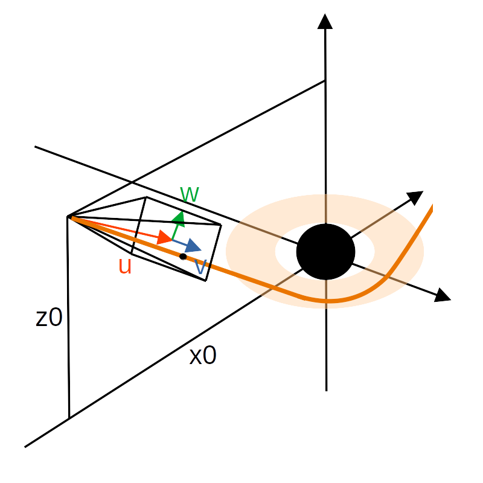
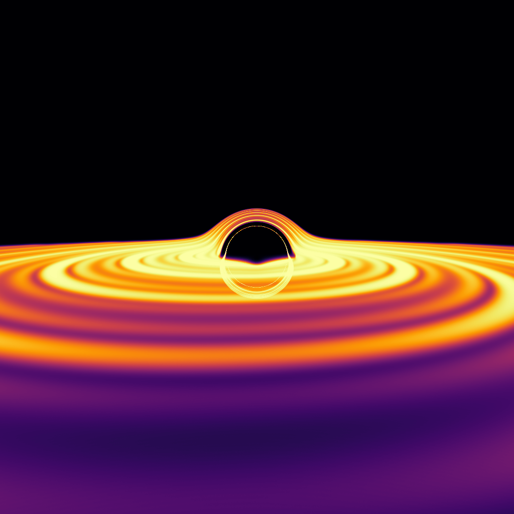
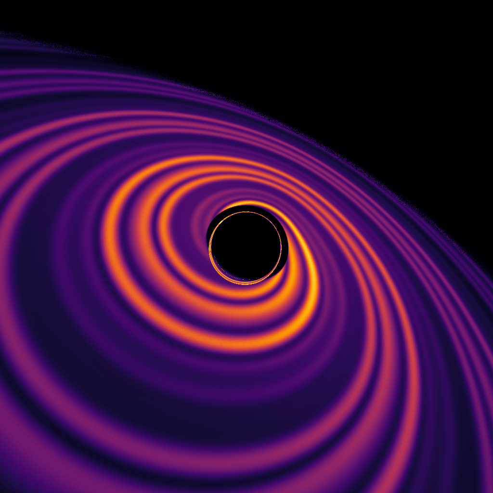
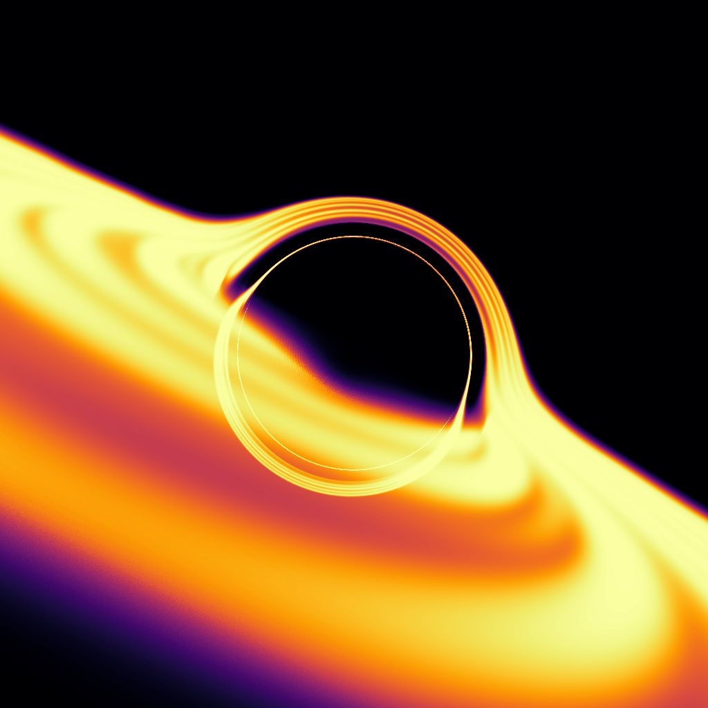
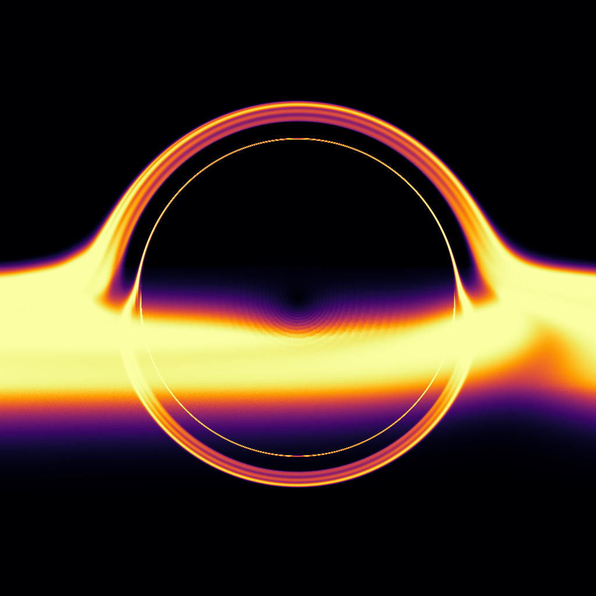

# Ray tracing black holes in numpy

This is a super simple 100 lines python script to ray-trace black holes.

Ray tracing in Schwarzschild metric is equivalent to propagating in euclidian geometry massive particles subject to the force
```math
F(r)=-\frac{3}{2}h^2\frac{\hat{r}}{r^5}
```
where $h$ is the angular momentum of the particle.
We propagate the particles from the camera as follow :


# Galery








